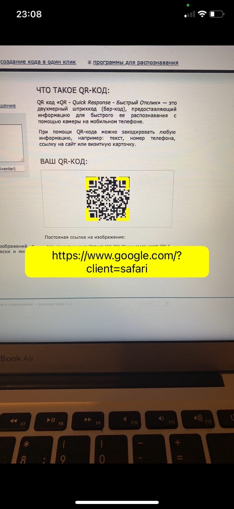
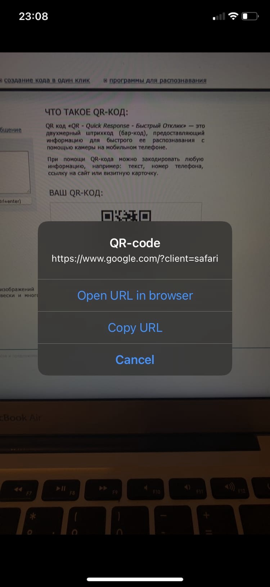

## Описание приложения

Приложение сканирует QR-код с помощью камеры телефона.

При наведении на QR-код появляется рамка и URL-адрес.

При нажатии на URL-адрес появляется алерт с тремя действиями:

- открыть URL-адрес в браузере
- скопировать URL-адрес в буфер обмена
- закрыть алерт

 
